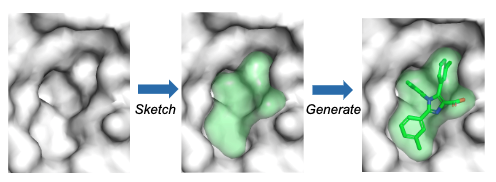
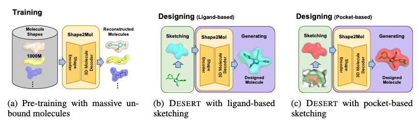

# DESERT
Zero-Shot 3D Drug Design by Sketching and Generating (NeurIPS 2022)

<!-- 
 -->
<div  align="center">    

</div>
<div  align="center">    

</div>

## Requirement
Our method is powered by an old version of [ParaGen](https://github.com/bytedance/ParaGen) (previous name ByCha).

Install it with
```bash
cd mybycha
pip install -e .
pip install horovod
pip install lightseq
```
You also need to install
```bash
conda install -c "conda-forge/label/cf202003" openbabel # recommend using anaconda for this project 
pip install rdkit-pypi
pip install pybel scikit-image pebble meeko==0.1.dev1 vina pytransform3d
```

## Pre-training

### Data Preparation
Our training data was extracted from the open molecule database [ZINC](https://zinc.docking.org/). You need to download it first. 

To get the fragment vocabulary
```bash
cd preparation
python get_fragment_vocab.py # fill blank paths in the file first
```

To get the training data
```bash
python get_training_data.py # fill blank paths in the file first
```

We also provide partial training data and vocabulary [Here](https://drive.google.com/drive/folders/1T2tKgILJAIMK6uTuhh3-qV-Ib0JVgaBs?usp=sharing).

### Training Shape2Mol Model

You need to fill blank paths in configs/training.yaml and train.sh.

```bash
bash train.sh
```

## Design Molecules

### Sketching

### Generating

## Citation
```
@inproceedings{long2022DESERT,
  title={Zero-Shot 3D Drug Design by Sketching and Generating},
  author={Long, Siyu and Zhou, Yi and Dai, Xinyu and Zhou, Hao},
  booktitle={NeurIPS},
  year={2022}
}
```
